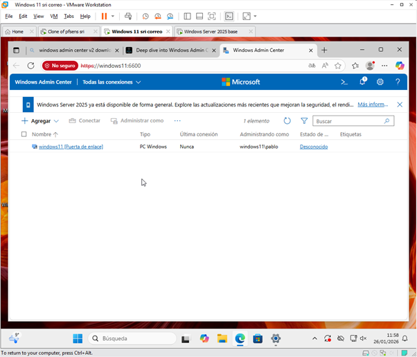
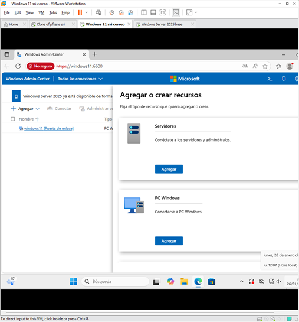
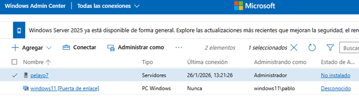
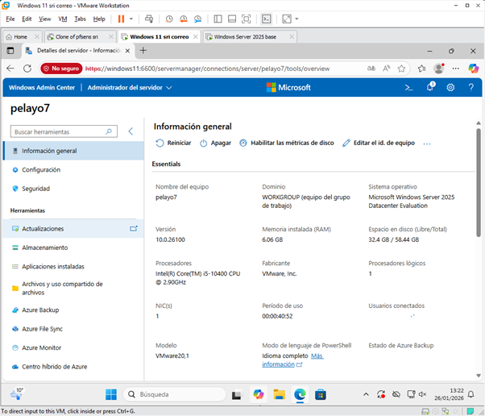
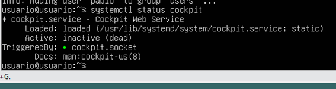
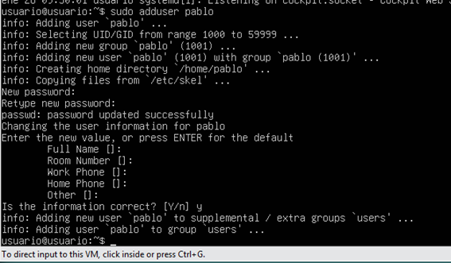
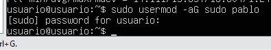
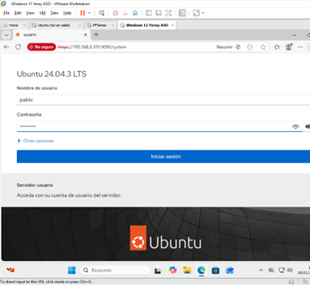
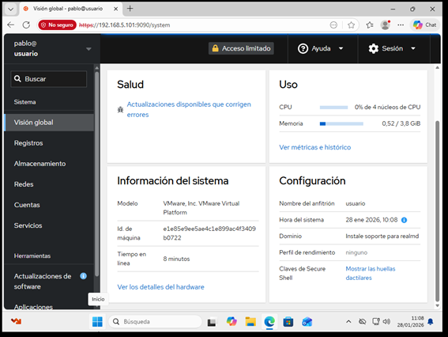

# PRACTICA 1: WAC Y COCKPIT

| Sistema | Usuario remoto | Herramienta | Protocolo | Puerto |
|---------|----------------|-------------|-----------|--------|
| Windows 11 | Administrador | Windows Admin Center | HTTPS | 6600 |

## PARTE 1 – WINDOWS ADMIN CENTER (WAC) 

### 1.1. Acceso a Windows Admin Center

Primero vamos a la pagina de microsoft y descargamos WAC, 
mas tarde nos conectamos con nuestro usuario de la maquina local

### 1.2. Administración remota del Windows Server

Para agregar el windows server tenemos que hacer click sobre agregar servidor,
nos pedira su nombre o direccion ip y tendremos que poner su usuario Adminisrador 
y la contraseña

### 1.3. Prueba de conexion con windows server desde WAC

despues de hacer el paso anterior nos aparecera en el menu el nombre de nuestro servidor, hacemos click sobre el y accederiamos

## PARTE 2 – Cockpit (Linux)

| Sistema | Usuario remoto | Herramienta | Protocolo | Puerto |
|---------|----------------|-------------|-----------|--------|
|  Linux | pablo | cockpit | HTTPS | 9090 |

### 1.1. Comprobación del servicio Cockpit

comprobamos si esta instalado con systemctl, si no lo esta lo instalamos

### 1.2. Creación de usuario remoto para administración

creamos un usuario para acceer desde windows 11 y le asignamos permisos sudo

### 1.3. Acceso a cockpit desde windows 11
para acceder ponemos en el navegador de windows 11 la direccion del ubuntu server desde el puerto 9090

### 1.4. Monitorizacion

Pantalla de inicio donde se observan caracteristicas del sistema
