# UT4_Practica2_Acceso_Remoto

## PARTE 1 – Acceso remoto seguro por SSH

### 1.1. Servicio SSH

Comprobamos que tenemos activo el servicio

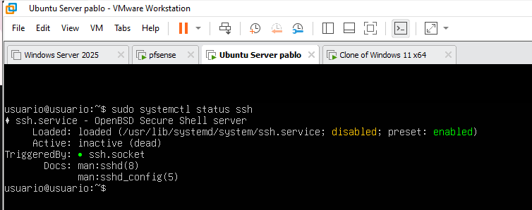

### 1.2. Usuario exclusivo para acceso SSH

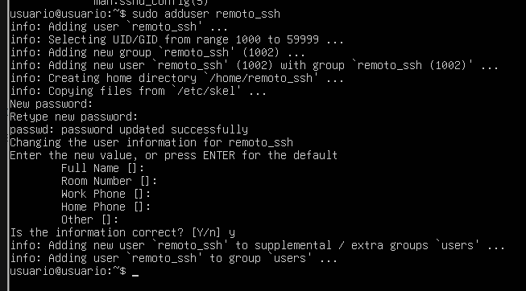

### 1.3. Configuración inicial del acceso por clave

#### 1.3.1. Generar un par de claves en Windows 11

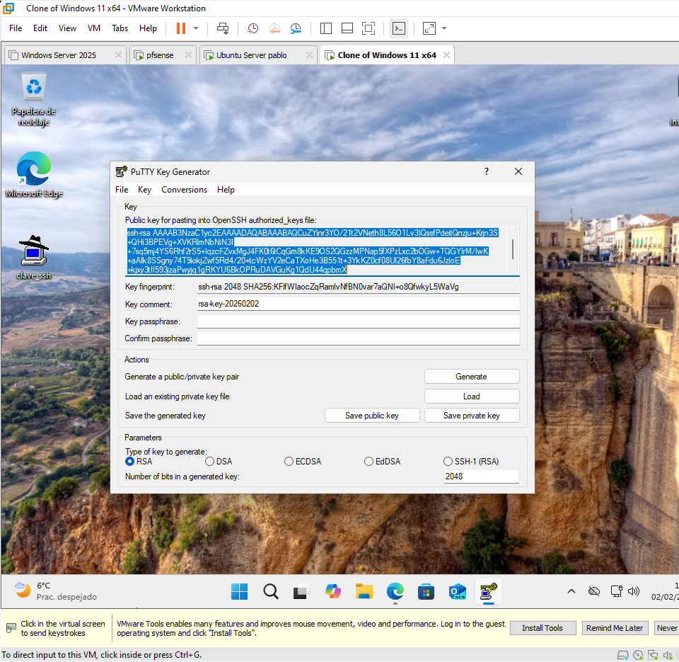

#### 1.3.2. Copiar la clave pública al servidor Ubuntu

Entramos por ssh al Ubuntu con nuestro usuario creado anteriormente para poder pegar la clave en el archivo
despues de hacer el paso anterior nos aparecera en el menu el nombre de nuestro servidor, hacemos click sobre el y accederiamos

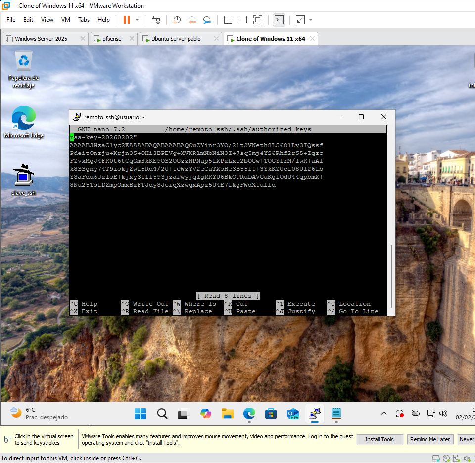

#### 1.3.3. Configurar el usuario remoto_ssh para que el servidor reconozca la clave pública

Creamos el archivo authoricedkeys dentro de la carpeta personal del usuario y asignamos permisos de seguridad, ponemos el “.” delante del nombre de la carpeta para que sea oculto, en ese archivo pegamos la clave generada anteriormente

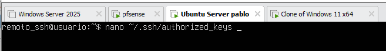

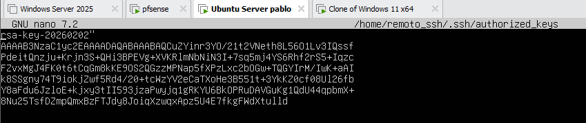

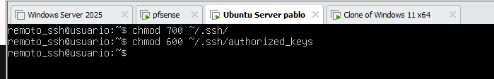

### 1.4. Configuración inicial del acceso por clave

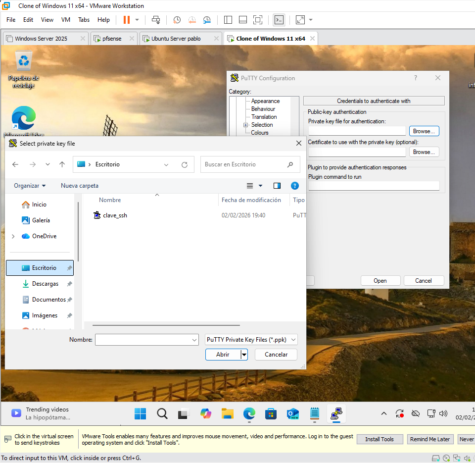

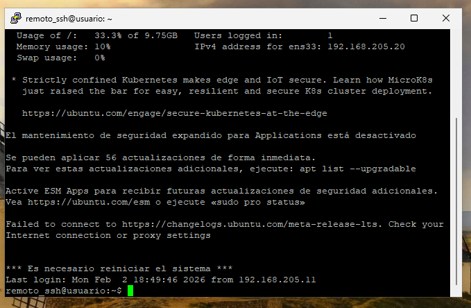

### 1.5. Bloqueo del acceso por contraseña

Descomentamos esta línea y ponemos no en el fichero sshd_config

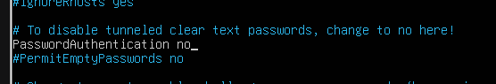

Y descomentamos también esta línea

Después de esto reiniciamos el servicio 

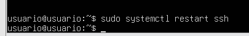

### 1.6. Prueba final de acceso autorizado

Cargamos la clave privada:

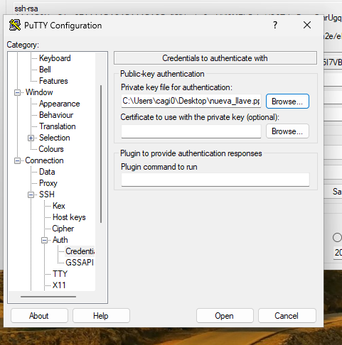

Le damos a save y entramos:

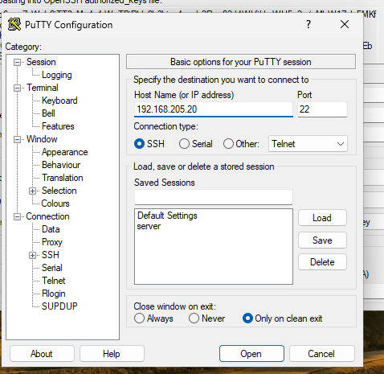

Ahora al entrar a putty no nos pide la contraseña

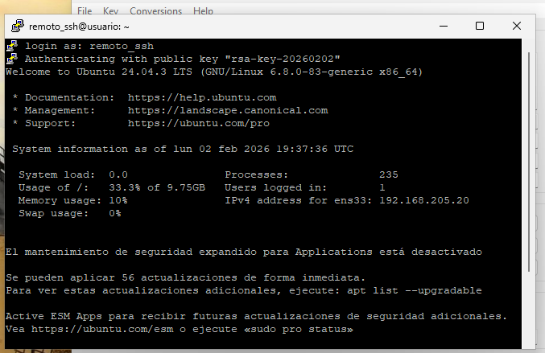

## PARTE 2 – Administración remota gráfica (RDP)

### 2.1. Habilitar escritorio remoto en el equipo

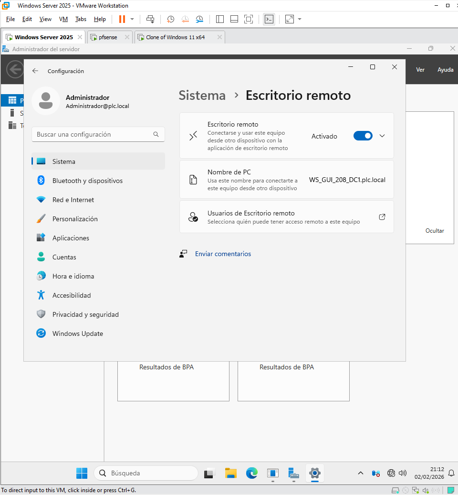

Lo agregamos a usuarios de escritorio remoto: 

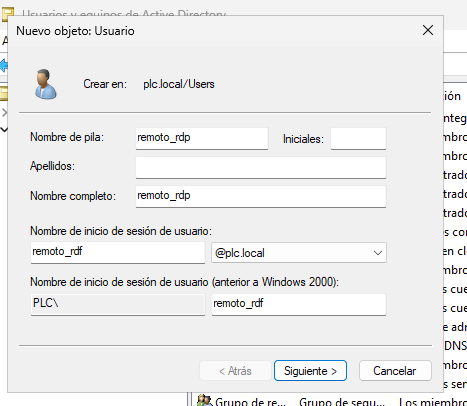

### 2.3. Usuario remoto dedicado para RDP

Lo agregamos a usuarios de escritorio remoto: 

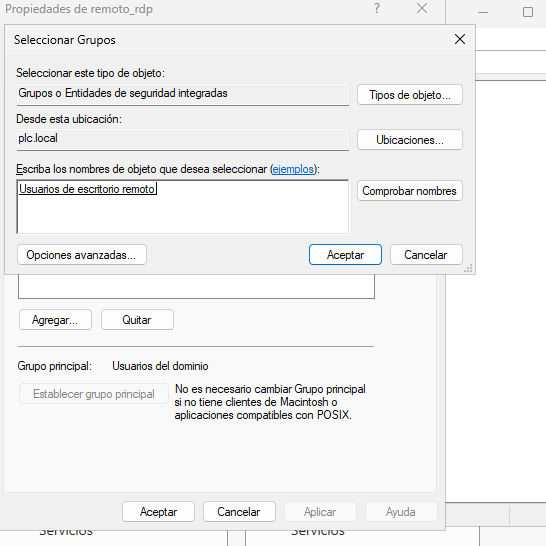

### 2.3. Permitir conexiones solo con autenticación de nivel de red

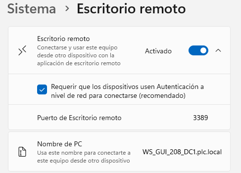

### 2.4. Acceso RDP desde Windows 11

ponemos la direccion del equipo al que queremos conectarnos

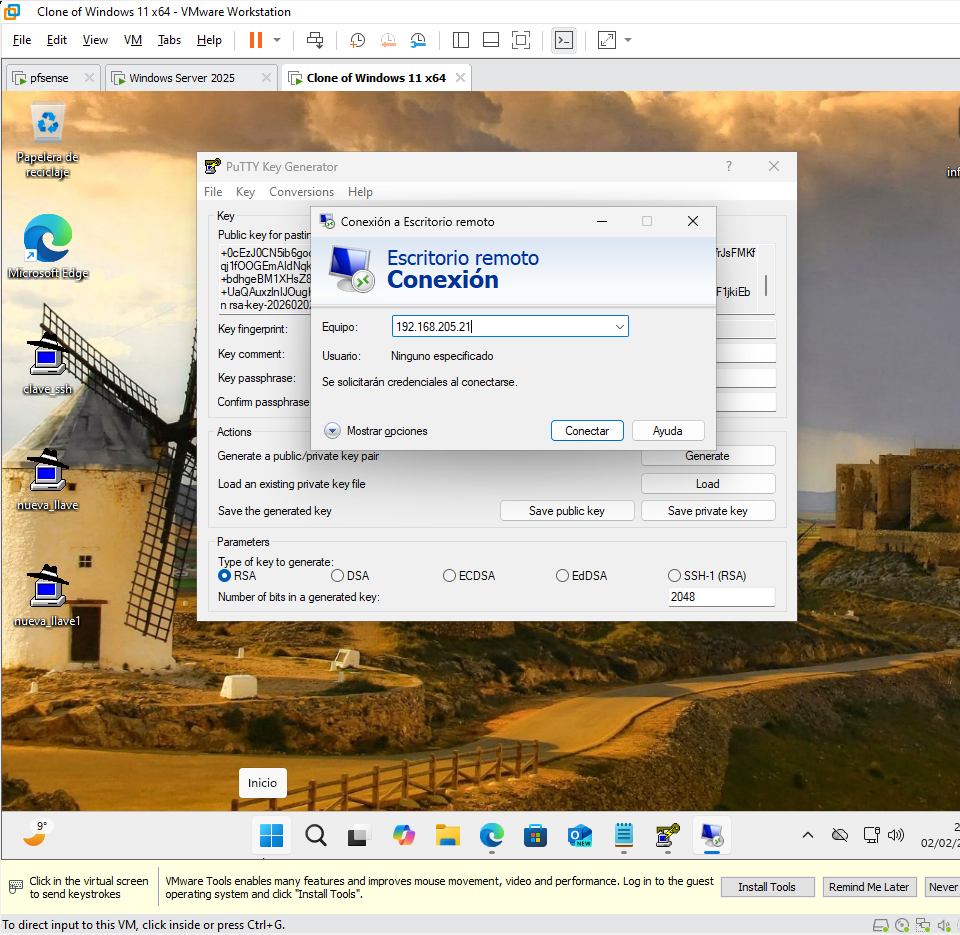